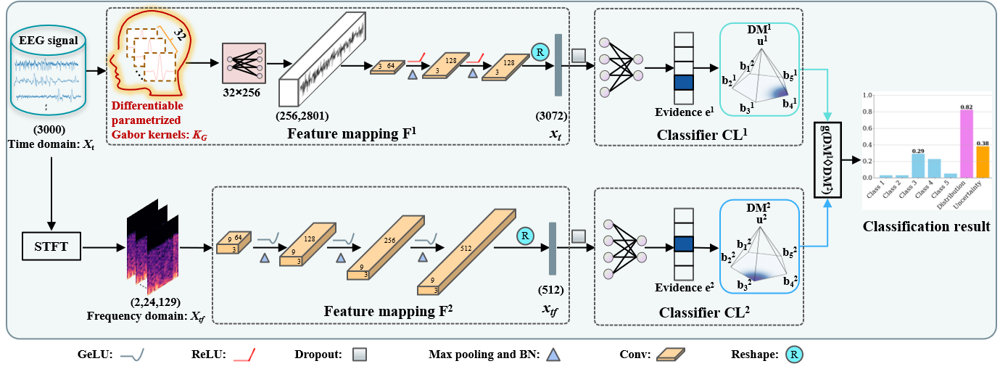

# [Trusted Multi-View Classification with Expert Knowledge Constraints](https://openreview.net/pdf?id=U64wEbM7NB)
<div align="center">
  
**[_Xinyan Liang_<sup>1</sup>](https://xinyanliang.github.io/), [_Shijie Wang_<sup>1</sup>](https://jie019.github.io/), [_Yuhua Qian_<sup>1</sup>](http://dig.sxu.edu.cn/qyh/), _Qian Guo_<sup>2</sup>, _Liang Du_<sup>1</sup>, _Bingbing Jiang_<sup>3</sup>, _Tingjin Luo_<sup>4</sup>, _Feijiang Li_<sup>1</sup>**

<sup>1</sup>SXU <sup>2</sup>TYUST <sup>3</sup>HZNU <sup>4</sup>NUDT
</div>
<p align="center">
  <a href="https://openreview.net/pdf?id=U64wEbM7NB">
    
  </a>
</p>

## Abstract

Trusted multi-view classification (TMVC) based on the Dempster-Shafer theory has gained significant recognition for its reliability in safety-critical applications. However, existing methods predominantly focus on providing confidence levels for decision outcomes without explaining the reasoning behind these decisions.
Moreover, the reliance on first-order statistical magnitudes of belief masses often inadequately capture the intrinsic uncertainty within the evidence. 
To address these limitations, we propose a novel framework termed Trusted Multi-view Classification Constrained with Expert Knowledge (TMCEK). TMCEK integrates expert knowledge to enhance feature-level interpretability and introduces a distribution-aware subjective opinion mechanism to derive more reliable and realistic confidence estimates. The theoretical superiority of the proposed uncertainty measure over conventional approaches is rigorously established. Extensive experiments conducted on three multi-view datasets for sleep stage classification demonstrate that TMCEK achieves state-of-the-art performance while offering interpretability at both the feature and decision levels. These results position TMCEK as a robust and interpretable solution for MVC in safety-critical domains.

## 🏗️Model
<div align="center">
  
</div>

## 🛏️Experiment 1: Sleep Stage Classification
In this experiment, we investigate the effectiveness of TMCEK on sleep stage classification using EEG signals.
### Directory Structure
The experiment directory is organized as follows:
```bash
Sleep stage classification/
├── data/
│   └── Sleep-EDF 20/
│       └── SC4001E0.npz
├── E1_model_test.py
├── E1_model_training.py
├── E2_lstm_data_prep.py
├── E2_lstm_test.py
├── E2_lstm_training.py
└── loss_function.py
```

### Data

We used three public datasets in this experiment:
- [Sleep-EDF20](https://www.physionet.org/content/sleep-edfx/1.0.0/)
- [Sleep-EDF78](https://www.physionet.org/content/sleep-edfx/1.0.0/)
- [Sleep Heart Health Study (SHHS)](https://sleepdata.org/datasets/shhs)
  
### Experiment Workflow
Below we split the workflow into two phases: **Single-Epoch Network (E1)** which processes each epoch independently, and **Multi-Epoch Network (E2)** which leverages sequential epoch information for enhanced modeling.

#### Training
1. **Train E1 (Single-Epoch Network)**
```bash
python E1_model_training.py 
```
2. **Preprocess data for E2 (Multi-Epoch Network)**  
```bash
 python E2_lstm_data_prep.py
```
3. **Train E2 (Multi-Epoch Network)**
```bash
python E2_lstm_training.py 
```

#### Inference
Once training is complete, evaluate each network on datasets.
1. **Evaluate E1 (Single-Epoch Network)**
```bash
python E1_model_test.py 
```
2. **Evaluate E2 (Multi-Epoch Network)**
```bash
python E2_lstm_test.py 
```

## 🎞️Experiment 2: Multi-view Classification
In this experiment, we evaluate TMCEK across standard multi-view benchmarks.
### Directory Structure
The experiment directory is organized as follows:
```bash
Multi-view Classification/
├── data/
│   └── PIE_face_10.mat
├── dataset.py
├── loss_function.py
├── main.py
└── model.py  
```

### Data
We used four public datasets in this experiment:
- [HandWritten (HW)](https://archive.ics.uci.edu/dataset/72/multiple+features)
- [Scene15](https://figshare.com/articles/dataset/15-Scene_Image_Dataset/7007177/1)
- [CUB](https://www.vision.caltech.edu/visipedia/CUB-200.html)
- [PIE](http://www.cs.cmu.edu/afs/cs/project/PIE/MultiPie/Home.html)

### Experiment Workflow
The training process can be completed using a single script:
```bash
python main.py
```
## 📑Citation
If you find this repository useful, please cite our paper:
```
@inproceedings{
liang2025trusted,
title={Trusted Multi-View Classification with Expert Knowledge Constraints},
author={Xinyan Liang, Shijie Wang, Yuhua Qian, Qian Guo, Liang Du, Bingbing Jiang, Tingjin Luo, Feijiang Li},
booktitle={International Conference on Learning Representations},
year={2025},
url={https://openreview.net/pdf?id=U64wEbM7NB}
}
```

## 🔬 Related Work
We list below the works most relevant to this paper, including but not limited to the following (roughly ordered from most recent to earliest):
- Navigating Conflicting Views: Harnessing Trust for Learning [[paper]](https://arxiv.org/abs/2406.00958)
- Trusted Multi-View Classification via Evolutionary Multi-View Fusion 
- Enhancing Multi-View Classification Reliability with Adaptive Rejection
- Enhancing Testing-Time Robustness for Trusted Multi-View Classification in the Wild
- Trusted Multi-view Learning with Label Noise
- Trusted Multi-view Learning under Noisy Supervision
- Reliable Conflictive Multi-View Learning
- Safe multi-view deep classification
- Trusted Multi-View Deep Learning with Opinion Aggregation
- Trusted Multi-View Classification with Dynamic Evidential Fusion
- Trusted Multi-View Classification

<!-- ## 🙏 Acknowledgement -->

## 📬Contact
If you have any detailed questions or suggestions, you can email us: [wshijie0@163.com](mailto:wshijie0@163.com)
